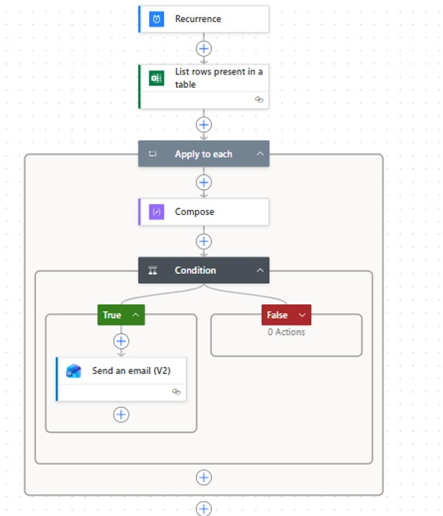

⚠️ Note: This project is currently a Work in Progress. I am documenting the automation logic and sanitizing the data templates for public viewing

# Lab-SOP-Automation-Inventory
Lab Automation for Expiry Records

Project Overview
This project solves the challenge of manual document tracking in a regulated laboratory environment. By integrating with readily software such as Microsoft Excel and Power Automate, I developed an automated system that monitors Standard Operating Procedure (SOP) expiry dates and sends proactive email notifications to stakeholders, ensuring 100% compliance with minimal manual oversight.

The Problem
In a high-stakes, compliant microbiology lab, managing hundreds of document lifecycles manually via standard spreadsheets poses significant operational risks:

High Risk of Human Error: Manual date checking relies on memory and routine, leading to potential oversight.

Audit Non-Compliance: Missed SOP review deadlines can cause major findings during strict quality audits.

Operational Inefficiency: Manually flagging expiring documents and chasing owners via email consumes valuable technical hours that could be spent on laboratory testing.

	
Tech Stack
Data Management: Microsoft Excel (Table-based tracking)
Automation: Power Automate (Cloud Flows)
Communication: Microsoft Outlook/Teams

	
The Solution:
I desgined a workflow as following:
1. Centralized Database : An Excel table stores SOP metadata (ID, Title, Owner and expiry_date)
2. Daily Trigger: A Power Automate flows runs every morning to scan the table
3. Conditional Logic: The system calculates the difference between Today() and the expiry_date
4. The exact Power Automate expression used to calculate this day threshold is:
   formatDateTime(addDays('1899-12-30', int(items('Apply_to_each')?['Review Date'])),'yyyy-MM-dd')    is less than or equal to    formatDateTime(addDays(utcNow(),30),'yyyy-MM-dd')
6. Tiered Alerts:
   - 30 Days Prior: Sends an intitial 'Re+
   - ki3mnjview Required' email to the SOP owner
   - 7 days Prior: Sends a 'Final Warning' alert
   - Expired: Flags the status as 'Non-compliant' in the master list.

Impact and Results
-Efficiency : Eliminated 2 hours of manual verification per month
-Compliance: Reduced missed review deadlines to 0%
-Scalability: The system can be easily expanded to track equipment calibration, inventory tracking or staff training records.

Project Roadmap (Upcoming Updates)
[ ] Upload a fully sanitized Excel tracker template (removing real company titles and personal emails).

